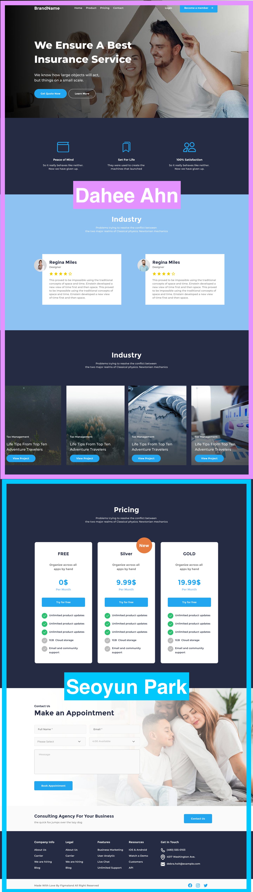

### Introduction

This is the 5th Team Project at Tamwood

### Objective

The objective of this assignment is to learn and practice developing a simple static website using the CSS Tailwind framework.

### Creator

This design is from https://www.figma.com/community/file/946390947835621236 by [Creator @CaptainDesign](https://www.figma.com/@captaindesign)

### Contributor

What [@daheeahn/Dahee Ahn](https://github.com/daheeahn) and [@Seoyoon16/Seoyun Park](https://github.com/Seoyoon16) worked on:

- (This is the original screenshot from Figma)
